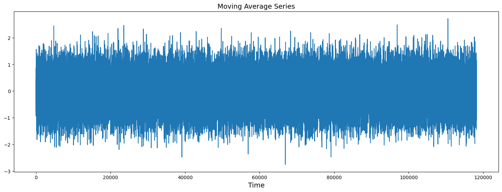
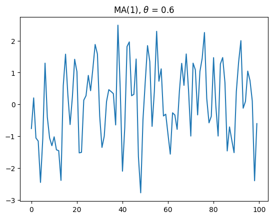

# Ex.No: 08     MOVING AVERAGE MODEL AND EXPONENTIAL SMOOTHING
### Date: 
#### NAME : YUVARAJ S
#### REG NO : 212222240119
### AIM:
To implement Moving Average Model and Exponential smoothing Using Python.
### ALGORITHM:
1. Import necessary libraries
2. Read the AirLinePassengers data from a CSV file,Display the shape and the first 20 rows of
the dataset
3. Set the figure size for plots
4. Suppress warnings
5. Plot the first 50 values of the 'Value' column
6. Perform rolling average transformation with a window size of 5
7. Display the first 10 values of the rolling mean
8. Perform rolling average transformation with a window size of 10
9. Create a new figure for plotting,Plot the original data and fitted value
10. Show the plot
11. Also perform exponential smoothing and plot the graph
### PROGRAM:
#### Import the packages
```py
# Importing Packages
import matplotlib.pyplot as plt
import pandas as pd
import numpy as np
from statsmodels.tsa.arima_process import ArmaProcess

# Reading Dataset
data = pd.read_csv("/content/Turbine_Data.csv")

# Generating White Noise
mean = 0
std = 1
n = len(data)
white_noise = np.random.normal(mean, std, size=n)

data['WhiteNoise'] = white_noise
w_series = pd.Series(white_noise)

# Applying Moving Average
window_size = 3
windows = w_series.rolling(window_size)
moving_averages = windows.mean()

# Plotting Moving Average Series
plt.figure(figsize=(18, 6))
plt.plot(moving_averages)
plt.title("Moving Average Series", fontsize=14)
plt.xlabel("Time", fontsize=14)
plt.show()

# Simulating ARMA Process
ar1 = np.array([1])
ma1 = np.array([1, 0.6])
data_subset = data['ActivePower'].iloc[:100]
MA_object = ArmaProcess(ar1, ma1)
simulated_data = MA_object.generate_sample(nsample=100)
simulated_series = pd.Series(simulated_data, index=data_subset.index)

# Plotting Simulated MA(1) Series
plt.plot(simulated_series)
plt.title("MA(1), $\\theta$ = 0.6")
plt.show()

```
### OUTPUT:





### RESULT:
Thus we have successfully implemented the Moving Average Model and Exponential smoothing using python.
